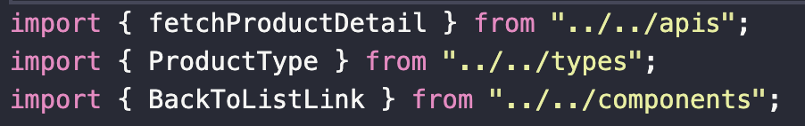
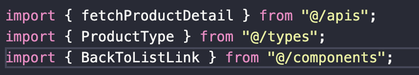

# 배컴 사전과제

아래 링크에서 확인 가능하십니다.

https://baecomm-assignment.netlify.app

## 사용 라이브러리

과제를 수행하는데 추가로 설치한 라이브러리는 아래와 같습니다.

- react-router-dom (routing)
- emotion (styling)

## 절대 경로 적용

모듈들을 분리하며 여러 디렉토리에서 모듈들을 가져오게 되었습니다.

상대 경로로 import 시, 위와 같이 지저분해지며 파일 위치가 바뀌는 것에 취약함을 보완하고자 tsconfig의 `compilerOptions.paths`를 이용하여 절대 경로를 적용하였습니다.

### 적용 과정

과제 요구사항이 `create-react-app` 으로 구현이였습니다.

`create-react-app`의 경우 내부의 webpack 설정으로 인해 tsconfig의 변경사항이 적용되지 않는 문제가 있었습니다.

제가 찾은 해결 방법으로는 아래와 같습니다.

1. `eject` 하여 webpack 파일 커스텀
2. `craco`를 통한 `create-react-app` 설정 오버라이딩

1의 경우, 한번 명령 시, 되돌릴 수 없으며 `create-react-app`이 관리하던 설정들을 직접 관리하게 된다는 단점들이 있었습니다.

단순 수정을 위해 감당할 리스크가 크다고 생각되어 2를 선택하였습니다.

### craco 적용

craco를 적용한 절차는 아래와 같습니다.

1. `@craco/craco`와 `react-app-alias` 의존성을 설치했습니다.
2. `tsconfig.paths.json`에 `paths` 관련 설정을 작성하여 `tsconfig.json` 에서 extends 하도록 하였습니다.
3. `craco.config.js` 파일에서 `react-app-alias` 플러그인과 함께 `tsconfig.paths.json` 설정이 적용될 수 있도록 하였습니다.
4. `package.json`의 `scripts` 들의 기존 `react-scripts ___`을 `craco ___` 으로 수정했습니다.

### 적용 후

적용 전 보다 import 문이 깔끔해지며, 파일 이동에도 유연해졌습니다.
